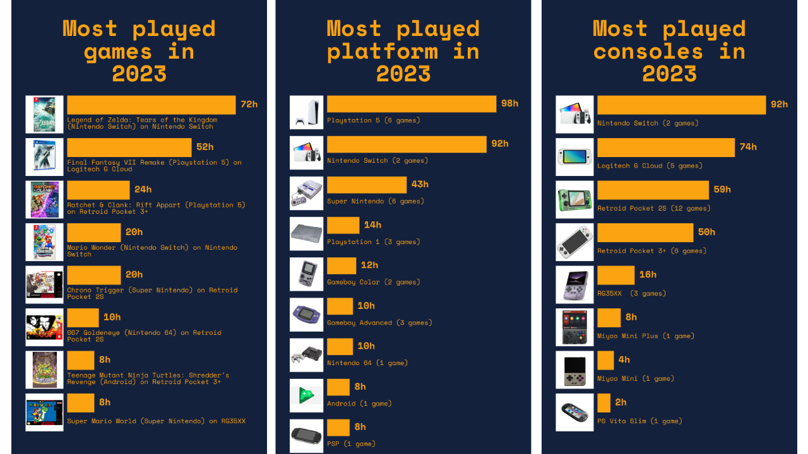

# Gaming recap generator

This article is about my personal exploration of my year in gaming, inspired by Spotify Wrapped, but with my own hands and a good amount of over-engineering. More about the project can be seen on [my website](https://aviebrantz.com/articles/2023/2023-12-29-overengineering-my-gaming-journey-intro/) with some results.



## Getting Started

You need Go installed, an Airtable account and  and for fetching images automatically

### Airtable API Key

You can check [this page](https://support.airtable.com/docs/creating-and-using-api-keys-and-access-tokens) to learn how to generate an API Key to use with this tool.

### Serper API 

You only need to create an account and on their dashboard, you can access the API Key on the "API Key" tab.

### Building and running locally

Create a copy of the `.env.template` file named `.env`. Then fill in the variables `AIRTABLE_API_KEY` and `SERPER_API_KEY` with the information obtained in the previous steps.

To run the Airtable to MySQL server locally, you can use the following command:

```
# install deps
$ go mod tidy 
# run Airtable to MySQL Server
$ go run cmd/server/main.go
```

Then to generate images, you can run in another terminal:
```
# run in another terminal 
$ go run cmd/imagegen/main.go --year 2023
```

## License
This gaming recap project is licensed under the MIT License. See the LICENSE file for more information.

I hope this helps! Let me know if you have any other questions.